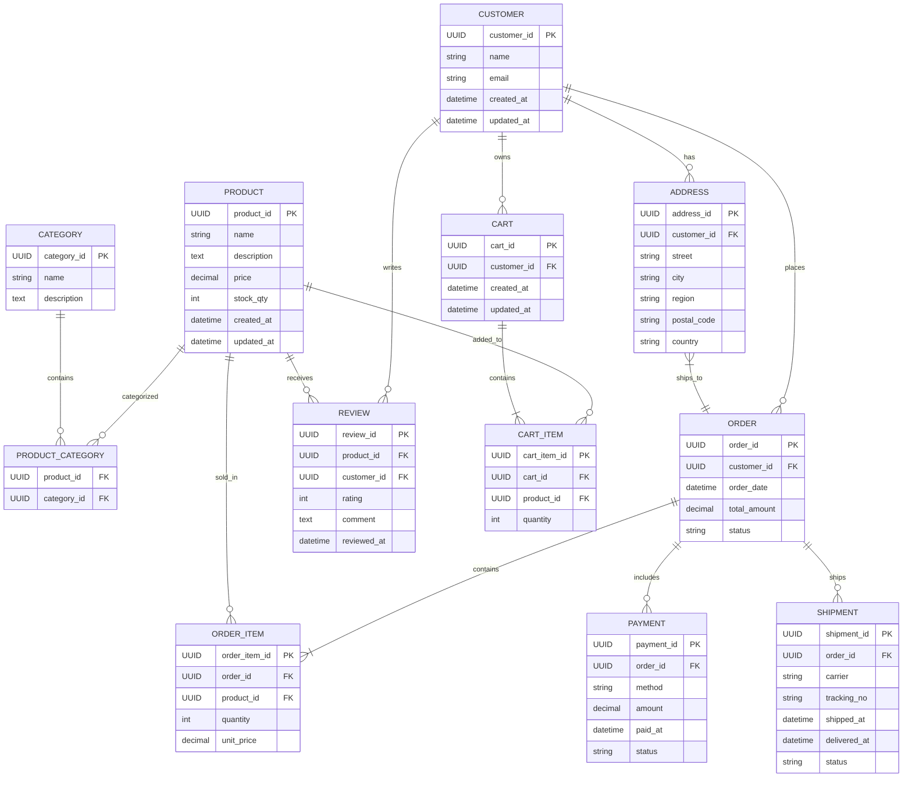

```mermaid
erDiagram
  CUSTOMER {
    UUID    customer_id    PK
    string  name
    string  email
    datetime created_at
    datetime updated_at
  }

  ADDRESS {
    UUID    address_id     PK
    UUID    customer_id    FK
    string  street
    string  city
    string  region
    string  postal_code
    string  country
  }

  PRODUCT {
    UUID    product_id     PK
    string  name
    text    description
    decimal price
    int     stock_qty
    datetime created_at
    datetime updated_at
  }

  CATEGORY {
    UUID    category_id    PK
    string  name
    text    description
  }

  PRODUCT_CATEGORY {
    UUID    product_id     FK
    UUID    category_id    FK
  }

  ORDER {
    UUID    order_id       PK
    UUID    customer_id    FK
    datetime order_date
    decimal total_amount
    string  status
  }

  ORDER_ITEM {
    UUID    order_item_id  PK
    UUID    order_id       FK
    UUID    product_id     FK
    int     quantity
    decimal unit_price
  }

  PAYMENT {
    UUID    payment_id     PK
    UUID    order_id       FK
    string  method
    decimal amount
    datetime paid_at
    string  status
  }

  SHIPMENT {
    UUID    shipment_id    PK
    UUID    order_id       FK
    string  carrier
    string  tracking_no
    datetime shipped_at
    datetime delivered_at
    string  status
  }

  REVIEW {
    UUID    review_id      PK
    UUID    product_id     FK
    UUID    customer_id    FK
    int     rating
    text    comment
    datetime reviewed_at
  }

  CART {
    UUID    cart_id        PK
    UUID    customer_id    FK
    datetime created_at
    datetime updated_at
  }

  CART_ITEM {
    UUID    cart_item_id   PK
    UUID    cart_id        FK
    UUID    product_id     FK
    int     quantity
  }

  CUSTOMER        ||--o{ ADDRESS          : has
  CUSTOMER        ||--o{ ORDER            : places
  CUSTOMER        ||--o{ REVIEW           : writes
  CUSTOMER        ||--o{ CART             : owns
  ADDRESS         }|--|| ORDER            : ships_to
  ORDER           ||--|{ ORDER_ITEM       : contains
  ORDER           ||--o{ PAYMENT          : includes
  ORDER           ||--o{ SHIPMENT         : ships
  PRODUCT         ||--o{ ORDER_ITEM       : sold_in
  PRODUCT         ||--o{ REVIEW           : receives
  PRODUCT         ||--o{ CART_ITEM        : added_to
  PRODUCT         ||--o{ PRODUCT_CATEGORY : categorized
  CATEGORY        ||--o{ PRODUCT_CATEGORY : contains
  CART            ||--|{ CART_ITEM        : contains
```