# バッチスケジュール

本ドキュメントでは、ECサイトの主要バッチの実行スケジュール（開始／終了時間の目安）を一覧化し、Mermaid形式のガントチャートで可視化します。

---

## 1. バッチ実行スケジュール一覧

| バッチID  | バッチ名                          | 実行スケジュール         | 開始時間（目安） | 終了時間（目安） | 所要時間（目安） |
|----------|----------------------------------|------------------------|-----------------|-----------------|-----------------|
| BT-001   | カート放棄リマインダー                | 毎日 02:00             | 02:00           | 02:05           | 5分             |
| BT-002   | 在庫同期バッチ                     | 毎時 00分              | HH:00           | HH:10           | 10分            |
| BT-003   | レコメンド更新バッチ               | 毎日 03:00             | 03:00           | 03:30           | 30分            |
| BT-101   | 日次売上レポート生成バッチ           | 毎日 01:00             | 01:00           | 01:20           | 20分            |
| BT-102   | 在庫アラートバッチ                 | 毎時 30分              | HH:30           | HH:40           | 10分            |
| BT-103   | 週次新規会員レポートバッチ           | 毎週月 04:00           | 月 04:00        | 月 04:30        | 30分            |
| BT-104   | 日次キャンセル集計バッチ             | 毎日 02:00             | 02:00           | 02:15           | 15分            |
| BT-201   | ログクリーンアップバッチ             | 毎日 00:30             | 00:30           | 00:40           | 10分            |
| BT-202   | メール送信ジョブバッチ               | 5分毎                  | XX:00 / XX:05   | +2分            | 2分             |
| BT-203   | キャッシュクリアバッチ               | 毎時                   | HH:00           | HH:05           | 5分             |

---

## 2. 実行スケジュール ガントチャート

```mermaid
gantt
    title バッチ実行ガントチャート
    dateFormat HH:mm
    axisFormat %H:%M

    section ECフロント
    カート放棄リマインダー       :bt001, 02:00, 5m
    在庫同期バッチ             :bt002, 00:00, 10m
    レコメンド更新バッチ         :bt003, 03:00, 30m

    section 管理サイト
    日次売上レポート生成バッチ    :bt101, 01:00, 20m
    在庫アラートバッチ           :bt102, 00:30, 10m
    週次新規会員レポートバッチ    :bt103, 04:00, 30m
    日次キャンセル集計バッチ      :bt104, 02:00, 15m

    section 共通
    ログクリーンアップバッチ      :bt201, 00:30, 10m
    メール送信ジョブバッチ        :bt202, 00:00, 2m
    キャッシュクリアバッチ        :bt203, 00:00, 5m
```

