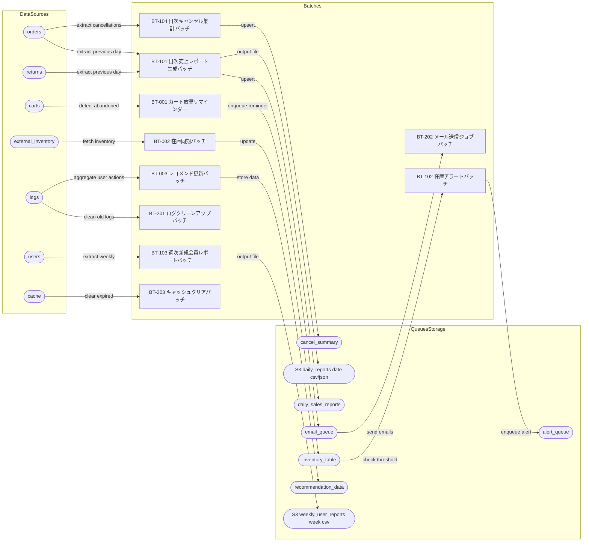

```mermaid
flowchart LR
  subgraph DataSources
    ORDERS(["orders"])
    RETURNS(["returns"])
    CARTS(["carts"])
    EXT_INV(["external_inventory"])
    LOGS(["logs"])
    USERS(["users"])
    CACHE(["cache"])
  end

  subgraph QueuesStorage
    MAIL_Q(["email_queue"])
    ALERT_Q(["alert_queue"])
    S3_DAILY(["S3 daily_reports date csv/json"])
    S3_WEEKLY(["S3 weekly_user_reports week csv"])
    INV_TABLE(["inventory_table"])
    REPORT_TABLE(["daily_sales_reports"])
    CANCEL_TABLE(["cancel_summary"])
    RECO_DATA(["recommendation_data"])
  end

  subgraph Batches
    BT002["BT-002 在庫同期バッチ"]
    BT203["BT-203 キャッシュクリアバッチ"]
    BT202["BT-202 メール送信ジョブバッチ"]
    BT201["BT-201 ログクリーンアップバッチ"]
    BT101["BT-101 日次売上レポート生成バッチ"]
    BT001["BT-001 カート放棄リマインダー"]
    BT104["BT-104 日次キャンセル集計バッチ"]
    BT003["BT-003 レコメンド更新バッチ"]
    BT102["BT-102 在庫アラートバッチ"]
    BT103["BT-103 週次新規会員レポートバッチ"]
  end

  EXT_INV -->|fetch inventory| BT002
  BT002 -->|update| INV_TABLE
  INV_TABLE -->|check threshold| BT102
  BT102 -->|enqueue alert| ALERT_Q

  CARTS -->|detect abandoned| BT001
  BT001 -->|enqueue reminder| MAIL_Q
  MAIL_Q -->|send emails| BT202

  ORDERS -->|extract previous day| BT101
  RETURNS -->|extract previous day| BT101
  BT101 -->|upsert| REPORT_TABLE
  BT101 -->|output file| S3_DAILY

  ORDERS -->|extract cancellations| BT104
  BT104 -->|upsert| CANCEL_TABLE

  LOGS -->|clean old logs| BT201

  LOGS -->|aggregate user actions| BT003
  BT003 -->|store data| RECO_DATA

  USERS -->|extract weekly| BT103
  BT103 -->|output file| S3_WEEKLY

  CACHE -->|clear expired| BT203
```