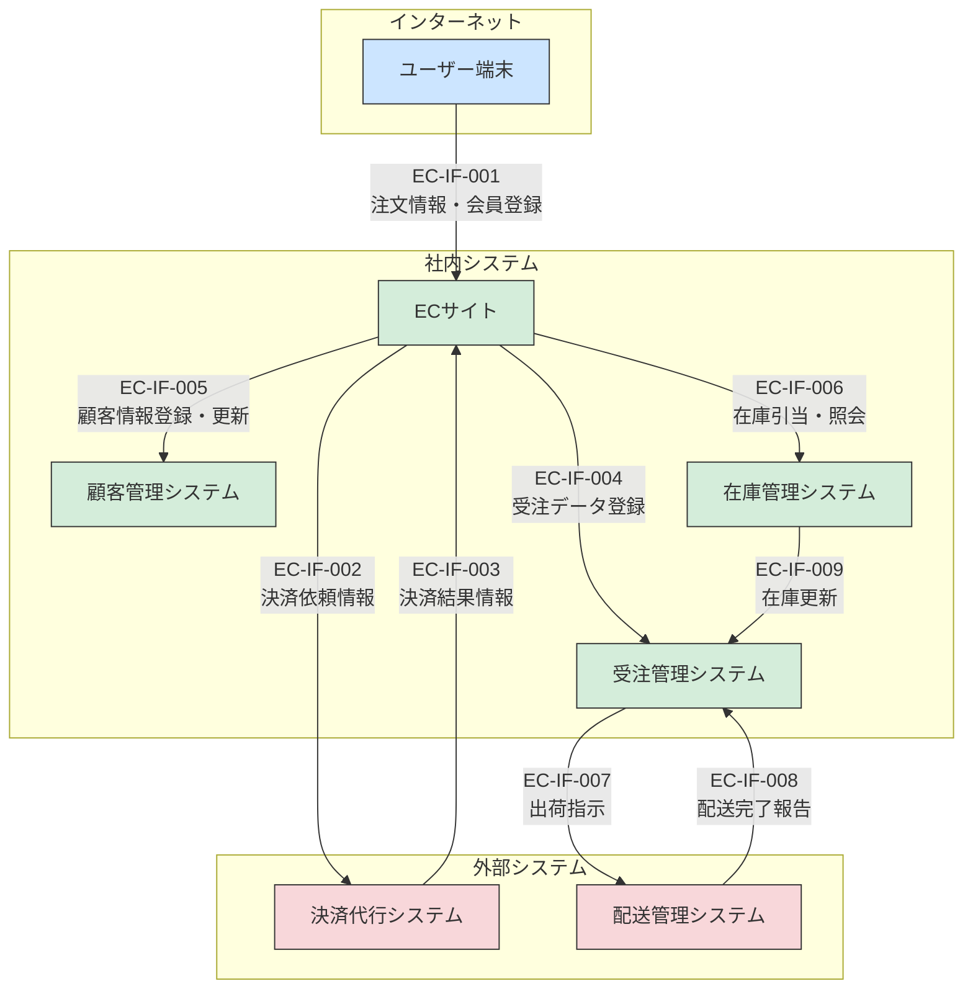

```mermaid
flowchart TD
    subgraph インターネット
        UserTerminal[ユーザー端末]
    end

    subgraph 社内システム
        EC[ECサイト]
        CustomerDB[顧客管理システム]
        OrderManagement[受注管理システム]
        InventorySystem[在庫管理システム]
    end

    subgraph 外部システム
        PaymentGateway[決済代行システム]
        DeliveryService[配送管理システム]
    end

    UserTerminal -- "EC-IF-001\n注文情報・会員登録" --> EC
    EC -- "EC-IF-002\n決済依頼情報" --> PaymentGateway
    PaymentGateway -- "EC-IF-003\n決済結果情報" --> EC
    EC -- "EC-IF-004\n受注データ登録" --> OrderManagement
    EC -- "EC-IF-005\n顧客情報登録・更新" --> CustomerDB
    EC -- "EC-IF-006\n在庫引当・照会" --> InventorySystem
    OrderManagement -- "EC-IF-007\n出荷指示" --> DeliveryService
    DeliveryService -- "EC-IF-008\n配送完了報告" --> OrderManagement
    InventorySystem -- "EC-IF-009\n在庫更新" --> OrderManagement

    classDef internet fill:#cce5ff,stroke:#333,stroke-width:1px;
    classDef internal fill:#d4edda,stroke:#333,stroke-width:1px;
    classDef external fill:#f8d7da,stroke:#333,stroke-width:1px;

    class UserTerminal internet;
    class EC,CustomerDB,OrderManagement,InventorySystem internal;
    class PaymentGateway,DeliveryService external;
```