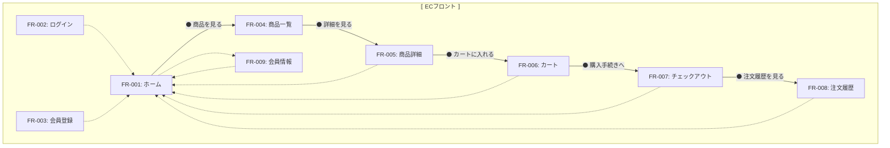
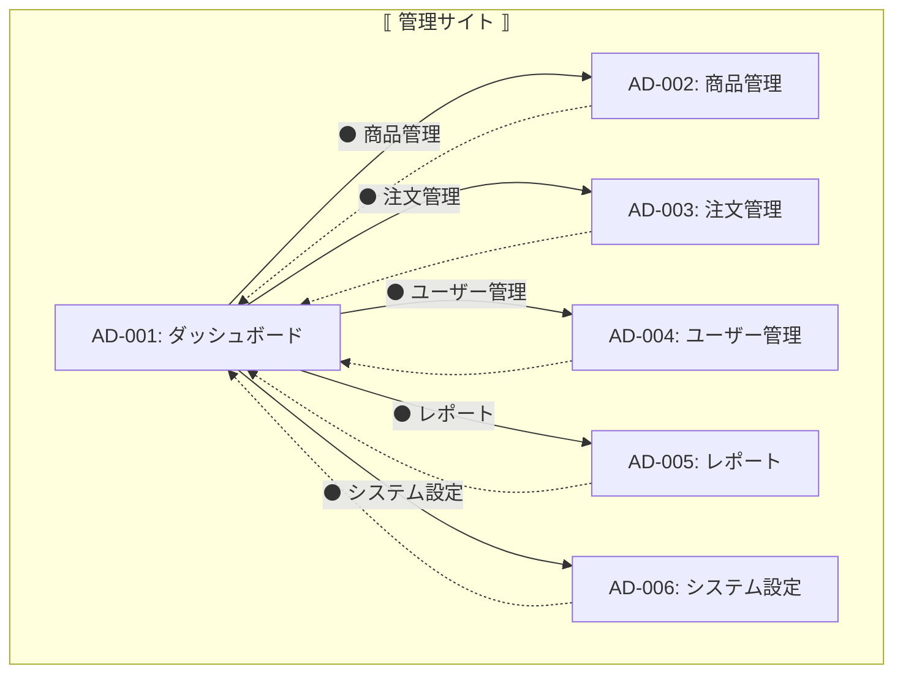

# アプリ画面遷移図

## 凡例

- ⚫ : ボタンまたはリンク（[   ]）
- ──▶ : 同じウィンドウ内での遷移
- -▶ : 親ウィンドウから子ウィンドウへのポップアップ
-     : 親ウィンドウ（メイン画面枠）
- ⟨⟨   ⟩⟩ : 子ウィンドウ（モーダル／ポップアップ）
- ▨   ▨ : 画面内の画面（パネル／セクション）
- ◇ : ダイアログ
- <> : 条件分岐（条件なしの場合は通常遷移）
- ◆ : ヘッダー付き画面

---

## 1. ECフロント画面遷移図

---

## 2. 管理サイト画面遷移図

---

※ それぞれの画面は親ウィンドウ内のメイン画面として扱います。実装ではモーダルや子ウィンドウの表現を追加してください。

