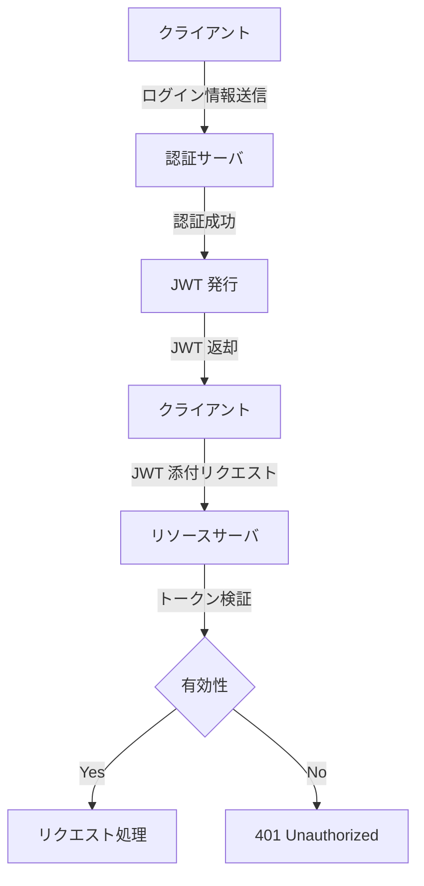
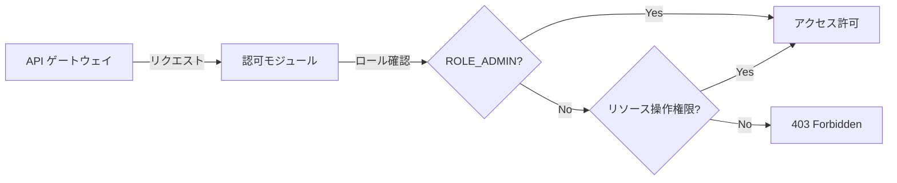

# 認証認可設計書

## 1. 目的

- システム利用者の本人性を厳格に確認し、不正アクセスを防止する認証基盤を設計する。citeturn0search8
- 各リソースへのアクセス権を適切に制御し、最小権限原則を徹底する認可モデルを定義する。citeturn0search3

## 2. 適用範囲

- Spring Boot ベースの EC サイトおよびマイクロサービス全体。citeturn0search10
- REST API／Web UI（Thymeleaf／React）双方の認証・認可制御。citeturn0search5
- OAuth2/OIDC／JWT／SAML といったトークンベースの方式を含む。citeturn0search0

## 3. 基本方針

1. **Secure by Design**: 開発初期から認証・認可フローを組み込む。citeturn0search13
2. **多要素認証 (MFA)** の導入による認証強化（例: TOTP／SMS）。citeturn0search8
3. **トークンベース認証**: JWT や OAuth2 アクセストークンでステートレスなセッション管理。citeturn0search0
4. **RBAC + ABAC** の組み合わせによる細粒度権限管理。citeturn0search3

## 4. 認証設計

### 4.1 認証方式

- **フォーム認証**（ユーザ名／パスワード + BCrypt）citeturn0search8  
- **JWT**: 発行・検証によりステートレス認証を実現。citeturn0search0  
- **OAuth2 Authorization Code** フロー（外部 IdP 連携）。citeturn0search9  
- **SAML**（企業向け SSO）  

### 4.2 認証フロー図


*ログインからトークン発行、リソースアクセスまでの流れを示す* citeturn0search1  

## 5. 認可設計

### 5.1 権限モデル

| モデル      | 概要                                         |
|-----------|--------------------------------------------|
| RBAC      | ロール（ROLE_USER, ROLE_ADMIN）単位で許可を管理   |
| ABAC      | ユーザ属性やリソース属性に基づく条件付き許可       |

### 5.2 認可フロー図


*リクエストがどのように認可判断されるかを視覚化* citeturn0search6  

## 6. 実装例

```java
@Configuration
@EnableWebSecurity
public class SecurityConfig {
    @Override
    protected void configure(HttpSecurity http) throws Exception {
        http
          .csrf().disable()
          .authorizeRequests()
            .antMatchers("/public/**").permitAll()
            .antMatchers("/user/**").hasRole("USER")
            .antMatchers("/admin/**").hasRole("ADMIN")
            .anyRequest().authenticated()
          .and()
          .oauth2ResourceServer()
            .jwt();
    }

    @Bean
    public JwtDecoder jwtDecoder() {
        return NimbusJwtDecoder.withJwkSetUri("https://idp.example.com/.well-known/jwks.json").build();
    }
}
```

- **@PreAuthorize** を用いたメソッドレベル制御例：  
  ```java
  @PreAuthorize("hasAuthority('ORDER_CREATE')")
  public Order createOrder(...) { … }
  ``` citeturn0search4

## 7. 運用・保守

- **ログ・監査**: 認証／認可イベントを構造化ログ（MDC に userId, roles, ipAddress を含む）で記録。citeturn0search13  
- **鍵／シークレット管理**: OAuth2 クライアントシークレットや JWT 署名鍵は Vault で安全に管理。  
- **定期レビュー**: 権限ポリシーと認証設定を年2回見直し。脆弱性スキャン（DAST）を CI/CD に統合。  

## 8. 参考

- OWASP Authentication Cheat Sheet citeturn0search8  
- OWASP Authorization Cheat Sheet citeturn0search3  
- Spring Security OAuth2 Authorization Code Flow (Baeldung) citeturn0search9  
- Spring Security AuthorizationManager (Baeldung) citeturn0search4  
- Spring Boot Security JWT Tutorial (JavaGuides) citeturn0search0  
- Mermaid Flowchart Syntax citeturn0search11  
- Javaでの認証／認可完全ガイド (IT trip) citeturn0search5  
- Authentication & Authorization with Spring-Boot (dev.to) citeturn0search10  
- Microservices Security Cheat Sheet (OWASP) citeturn0search13  
- mermaidでフローチャートを描く (Zenn) citeturn0search1

